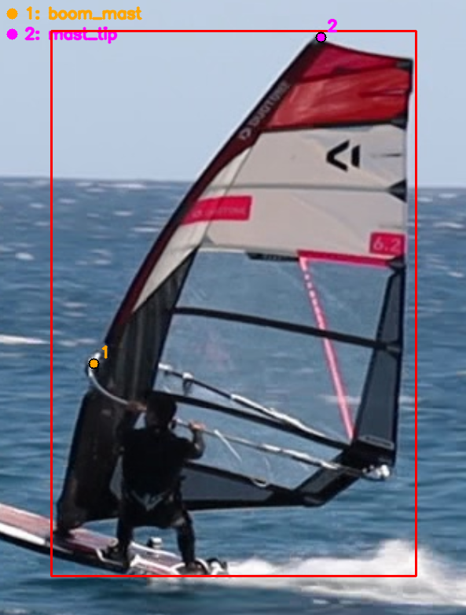
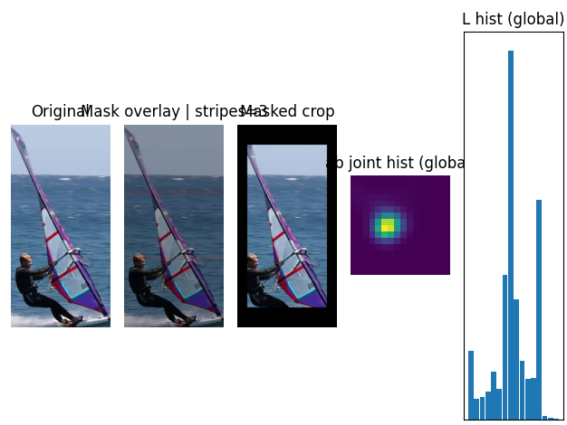
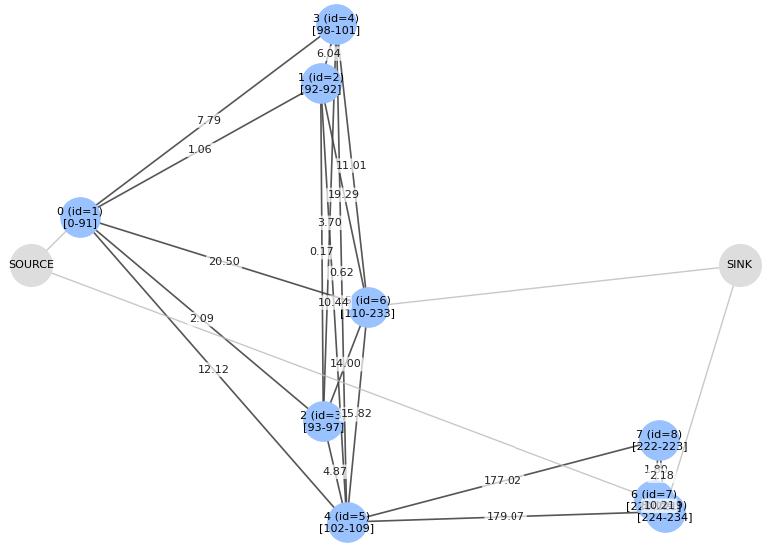
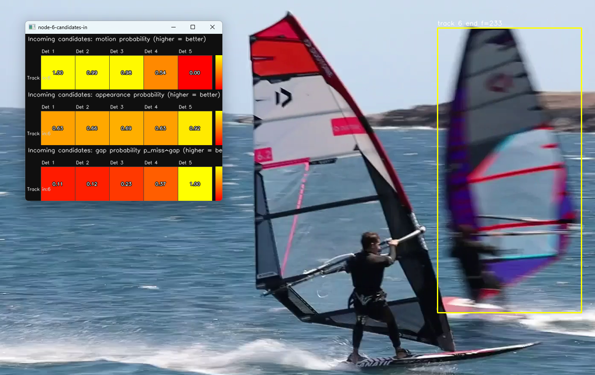

# Windsurf Analysis — Technical Deep Dive

This document is a developer-facing overview of how this repo turns raw windsurfing session footage into:

- per-frame detections (bbox + pose keypoints),
- per-surfer trajectories (tracks),
- a stabilized interactive viewing experience (overview + per-surfer “focused” crop),
- plus the tooling used to train, tune, and evaluate the system.

For further technical end-to-end overview + documentation map, see [`documentation/README.md`](https://github.com/BertilBraun/Windsurf-Analysis/blob/master/documentation/README.md).

---

## 1) High-level architecture

There are two “modes” of running the project:

1) **Local / research / iteration**
   - Pure Python pipeline + optional Qt tooling and optimization scripts.
   - Core code lives in [`video_processing/inference/src/…`](https://github.com/BertilBraun/Windsurf-Analysis/tree/master/video_processing/inference/src)

2) **Production MVP (web app)**
   - **Frontend** uploads a video to Firebase Storage and then polls/streams job status.
   - **Backend (FastAPI on Cloud Run)** manages job lifecycle and persists final results JSON to GCS/Firebase Storage.
   - **Modal** runs GPU inference + CPU tracking and posts results back to Cloud Run via internal endpoints.

The production control-flow is implemented in:

- Backend API: [`backend/routes/jobs.py`](https://github.com/BertilBraun/Windsurf-Analysis/blob/master/backend/routes/jobs.py)
- Backend internal callbacks (Modal -> Cloud Run): [`backend/routes/internal_jobs.py`](https://github.com/BertilBraun/Windsurf-Analysis/blob/master/backend/routes/internal_jobs.py)
- Modal "trigger" web endpoint (Cloud Run -> Modal): [`video_processing/main_trigger.py`](https://github.com/BertilBraun/Windsurf-Analysis/blob/master/video_processing/main_trigger.py)
- Modal orientation + detection + tracking workers: [`video_processing/main_orientation.py`](https://github.com/BertilBraun/Windsurf-Analysis/blob/master/video_processing/main_orientation.py), [`video_processing/main_inference.py`](https://github.com/BertilBraun/Windsurf-Analysis/blob/master/video_processing/main_inference.py), [`video_processing/main_tracking.py`](https://github.com/BertilBraun/Windsurf-Analysis/blob/master/video_processing/main_tracking.py)

---

## 2) End-to-end inference pipeline (Modal / local runner)

### Step A — Orientation normalization

Windsurfing footage is frequently recorded in arbitrary device orientation. The pipeline first predicts a **dominant orientation** and produces an upright video:

- Model: YOLO classification model (classes: 0/90/180/270)
- Strategy: sample frames, one forward pass, majority vote
- Rotation: ffmpeg transpose filters

See [`video_processing/inference/src/orientation_fixer.py`](https://github.com/BertilBraun/Windsurf-Analysis/blob/master/video_processing/inference/src/orientation_fixer.py) and Modal wrapper [`video_processing/main_orientation.py`](https://github.com/BertilBraun/Windsurf-Analysis/blob/master/video_processing/main_orientation.py).

### Step B — Detection (YOLO pose)

Detections are computed with Ultralytics YOLO, but this project expects a **pose model** because it relies on two keypoints:

- `boom_mast` (approximate mast/boom junction)
- `mast_tip`

Each detection becomes a `RawDetection` containing:

- bbox in pixel space,
- confidence,
- frame index,
- crop (image region for appearance extraction),
- the two keypoints (with per-kp confidence).

See [`video_processing/inference/src/tracking/detector.py`](https://github.com/BertilBraun/Windsurf-Analysis/blob/master/video_processing/inference/src/tracking/detector.py).

### Step C — Camera motion estimation (stabilization)

To make the “overview” view stable, the pipeline estimates per-frame camera motion while **masking out the surfers** so that moving subjects don’t dominate optical flow.

In production tracking ([`video_processing/main_tracking.py`](https://github.com/BertilBraun/Windsurf-Analysis/blob/master/video_processing/main_tracking.py)), transforms are computed in the same pass that crops detections:

- Feature points: GFTT (goodFeaturesToTrack)
- Tracking: Lucas–Kanade optical flow
- Transform: partial affine -> reduced to `(dx, dy, da)`
- Masking: excluded bboxes + margin

See:

- Masked estimator: [`video_processing/inference/src/visualization/stabilize.py`](https://github.com/BertilBraun/Windsurf-Analysis/blob/master/video_processing/inference/src/visualization/stabilize.py) (`MaskedVidStabEstimator`)
- Usage in Modal: `_compute_masked_vidstab_transforms_and_crop_detections()` in [`video_processing/main_tracking.py`](https://github.com/BertilBraun/Windsurf-Analysis/blob/master/video_processing/main_tracking.py)

The frontend expects **per-frame stabilization corrections** `(dx, dy, da)` anchored at frame `k` that are applied *directly* when rendering frame `k`.
To reduce jitter, the pipeline follows a VidStab-like smoothing rule:

- build cumulative trajectory from raw prev->curr deltas,
- smooth the trajectory with a rolling mean,
- compute the correction as `(smoothed_trajectory - trajectory)` per frame.

See `vidstab_like_correction_by_frame()` in [`video_processing/inference/src/visualization/stabilize.py`](https://github.com/BertilBraun/Windsurf-Analysis/blob/master/video_processing/inference/src/visualization/stabilize.py).

### Step D — Appearance features (ReID / descriptors)

After detection, the pipeline computes an appearance embedding for each detection crop. Several descriptor backends exist:

- `osnet`: deep ReID backbone
- `vit`: experimental
- `color_hist`: classic hist baseline
- `color_ab_stripe_hist`: a robust Lab/Hue histogram descriptor with vertical stripes and Hellinger-style normalization

Selection is controlled by `REID_MODEL_TYPE` in [`video_processing/inference/src/settings.py`](https://github.com/BertilBraun/Windsurf-Analysis/blob/master/video_processing/inference/src/settings.py).

See:

- Feature extraction orchestration: `EmbeddingExtractor` in [`video_processing/inference/src/tracking/detector.py`](https://github.com/BertilBraun/Windsurf-Analysis/blob/master/video_processing/inference/src/tracking/detector.py)
- Color AB stripe descriptor: [`video_processing/inference/src/tracking/reid/ReIDColorABStripeHistogram.py`](https://github.com/BertilBraun/Windsurf-Analysis/blob/master/video_processing/inference/src/tracking/reid/ReIDColorABStripeHistogram.py)
- Distance/probability helpers: [`video_processing/inference/src/util/similarity_helpers.py`](https://github.com/BertilBraun/Windsurf-Analysis/blob/master/video_processing/inference/src/util/similarity_helpers.py)

*Embedding-based appearance signal (used by tracker gating and ILP costs).*

### Step E - Multi-stage tracking (association)

Tracking is explicitly designed as **progressive refinement**:

1) **Greedy preprocessor**: quickly stitches obvious single-frame detections into short tracklets.
2) **Global optimization**: solves tracklet linking as a graph assignment / ILP.
3) **Post-processing**: filtering + dense interpolation + smoothing + relabeling.

Production uses the following tracker chain:

- `TrackPreProcessor()`
- `ILPTracker()`
- `TrackPostProcessing()`

See [`video_processing/main_tracking.py`](https://github.com/BertilBraun/Windsurf-Analysis/blob/master/video_processing/main_tracking.py).

---

## 3) Tracking internals

### 3.1 Greedy preprocessor (tracklet stitching)

The preprocessor operates on “tracks” that initially contain exactly one detection each. It maintains:

- a per-track Kalman filter state (`KFState`)
- an exponential moving average (EMA) appearance embedding
- an active vs stale track list

Association logic uses a **two-gate policy**:

- motion gate: probability derived from a Kalman gating distance (Mahalanobis)
- appearance gate: probability derived from embedding distance

It outputs longer tracklets and reduces the combinatorics for global optimization.

See [`video_processing/inference/src/tracking/preprocessing/greedy_track_stitcher.py`](https://github.com/BertilBraun/Windsurf-Analysis/blob/master/video_processing/inference/src/tracking/preprocessing/greedy_track_stitcher.py).

### 3.2 Global linking via ILP (graph assignment)

After pre-stitching, the tracker builds a directed graph of candidate links (A -> B) where:

- `A.end_frame < B.start_frame`
- the gap is within `MAX_OVERLAP_LENGTH_SECONDS`

Each candidate edge is assigned a cost that is the sum of negative log-likelihood (NLL) terms:

- **motion**: Kalman-based consistency under camera motion compensation
- **appearance**: distance between track prototypes mapped to probability, then to NLL
- **gap**: per-frame "miss" penalty (`p_miss`)

*Fragments (tracklets) are nodes; candidate links are directed edges scored by motion, appearance, and gap penalties.*

The ILP formulation chooses:

- a successor (or end) for each fragment,
- a predecessor (or start) for each fragment,
to minimize total cost.

See:

- Cost components: [`video_processing/inference/src/tracking/ilp_tracker.py`](https://github.com/BertilBraun/Windsurf-Analysis/blob/master/video_processing/inference/src/tracking/ilp_tracker.py)
- Iterative schedule + optional splitting: [`video_processing/inference/src/tracking/iterative_ilp_tracker.py`](https://github.com/BertilBraun/Windsurf-Analysis/blob/master/video_processing/inference/src/tracking/iterative_ilp_tracker.py)
- Solver: [`video_processing/inference/src/tracking/ILP_graph_solver.py`](https://github.com/BertilBraun/Windsurf-Analysis/blob/master/video_processing/inference/src/tracking/ILP_graph_solver.py) (PuLP + CBC)
- Camera motion compensation applied to the Kalman model: [`video_processing/inference/src/motion/cmc.py`](https://github.com/BertilBraun/Windsurf-Analysis/blob/master/video_processing/inference/src/motion/cmc.py)

*Example of candidate link scoring between fragment endpoints (used to prune and cost edges before solving).*

Why "iterative"?

The ILP can be biased by how strongly it discourages starting new tracks. The iterative tracker starts with a permissive start cost and can ramp it up across iterations, trading off:

- fewer fragmented tracks vs
- fewer incorrect merges.

### 3.3 Post-processing: filtering + dense smoothing

Tracks are converted into dense per-frame detection sequences and smoothed with an RTS (Rauch–Tung–Striebel) smoother:

- forward Kalman filter pass,
- optional backward smoothing pass,
- gap filling + bbox smoothing in one model.

This is what enables:

- stable visualization,
- consistent per-frame hit-testing,
- anchor/scale computation.

See [`video_processing/inference/src/tracking/track_processing.py`](https://github.com/BertilBraun/Windsurf-Analysis/blob/master/video_processing/inference/src/tracking/track_processing.py).

---

## 4) Rendering signals: anchor + scale (pose-aware “camera”)

Instead of cropping around a bbox center, the frontend uses two pose-derived signals computed per detection:

- **anchor**: a stable point derived from keypoints (and fallbacks) to center the crop
- **scale**: a normalized crop-height fraction (0..1) based on mast length / bbox heuristics

These are computed per-frame for each (dense) track and emitted as `RenderableTrack`s.

See [`video_processing/inference/src/tracking/renderable_tracks.py`](https://github.com/BertilBraun/Windsurf-Analysis/blob/master/video_processing/inference/src/tracking/renderable_tracks.py).

This is why the detector is a **pose model**: without the mast keypoints, “focused view” stabilization is much harder (bbox-based zoom tends to pump and drift).

---

## 5) Data contract (what the frontend consumes)

The production backend ultimately exposes a single “render contract” for the player:

- `dominant_orientation` (0/90/180/270 degrees)
- `tracks[]`:
  - `start_percent`, `end_percent`
  - `detections[]`: `time_percent`, `bbox` (normalized), `anchor` (normalized), `scale`, `confidence`, `interpolated`
- `stabilization_transforms[]`: `time_percent`, `dx`, `dy`, `da` (radians)

See:

- Backend types: [`backend/models.py`](https://github.com/BertilBraun/Windsurf-Analysis/blob/master/backend/models.py)
- Frontend types: [`frontend/src/ui/types.ts`](https://github.com/BertilBraun/Windsurf-Analysis/blob/master/frontend/src/ui/types.ts)
- Result assembly in Modal tracking: [`video_processing/main_tracking.py`](https://github.com/BertilBraun/Windsurf-Analysis/blob/master/video_processing/main_tracking.py)

The key idea is that the frontend does not need any ML models. It only needs:

- per-frame (or near per-frame) track signals for hit-testing + rendering,
- plus stabilization transforms to de-jitter the “overview” camera.

---

## 6) Frontend player (rendering + decoding)

The frontend is a React app (Vite) with an in-browser player that:

- decodes local video files in the browser (`mediabunny`),
- renders either:
  - **overview mode**: full frame + track overlays + stabilization compensation, or
  - **detailed mode**: per-surfer crop based on `anchor` + `scale`.

Key code:

- Video decoding and seeking window/cache: [`frontend/src/ui/player/useWebCodexPlayer.ts`](https://github.com/BertilBraun/Windsurf-Analysis/blob/master/frontend/src/ui/player/useWebCodexPlayer.ts)
- Player state (binary-search access to per-frame detections): [`frontend/src/ui/player/state.ts`](https://github.com/BertilBraun/Windsurf-Analysis/blob/master/frontend/src/ui/player/state.ts)
- Stabilized overview transforms + crop math: [`frontend/src/ui/player/rendering.ts`](https://github.com/BertilBraun/Windsurf-Analysis/blob/master/frontend/src/ui/player/rendering.ts)
- The interactive player component: [`frontend/src/ui/player/Player.tsx`](https://github.com/BertilBraun/Windsurf-Analysis/blob/master/frontend/src/ui/player/Player.tsx)

Important detail: the frontend applies stabilization transforms in the overview view, but the per-surfer focused view is stabilized primarily by the pose-derived crop (anchor + scale), not by global camera motion.

---

## 7) Backend job system (web MVP)

The backend is FastAPI and uses:

- Firebase Auth (ID token) for user-facing endpoints,
- a shared secret header for internal Modal callbacks,
- Firestore for job metadata and quotas,
- GCS/Firebase Storage for job results JSON (avoids Firestore document size limits).

Flow:

1) Frontend creates job: `POST /jobs` (checksum-based de-dup)
2) Frontend uploads video to Firebase Storage
3) Frontend marks upload complete: `POST /jobs/{id}/upload/complete`
4) Backend calls Modal trigger endpoint (shared-secret protected)
5) Modal updates status via `POST /internal/jobs/{id}/status`
6) Modal posts final results via `POST /internal/jobs/{id}/results`
7) Backend persists results JSON and marks job succeeded

See:

- Public routes: [`backend/routes/jobs.py`](https://github.com/BertilBraun/Windsurf-Analysis/blob/master/backend/routes/jobs.py)
- Internal routes: [`backend/routes/internal_jobs.py`](https://github.com/BertilBraun/Windsurf-Analysis/blob/master/backend/routes/internal_jobs.py), [`backend/auth/internal_auth.py`](https://github.com/BertilBraun/Windsurf-Analysis/blob/master/backend/auth/internal_auth.py)
- Result storage helper: [`backend/storage/gcs_json.py`](https://github.com/BertilBraun/Windsurf-Analysis/blob/master/backend/storage/gcs_json.py)
- Modal trigger service: [`video_processing/main_trigger.py`](https://github.com/BertilBraun/Windsurf-Analysis/blob/master/video_processing/main_trigger.py)

---

## 8) Evaluation, tuning, and “golden” data

Tracking is tuned using human-supervised “golden” association data:

- `annotate_tracklets.py` runs detection + preprocessor, then provides a UI to merge tracklets into ground-truth identities.
- Optimization scripts use Optuna to search hyperparameters using basian optimization and evaluate with a pairwise F1-style association metric.

See:

- Golden creation: [`video_processing/inference/optimization/annotate_tracklets.py`](https://github.com/BertilBraun/Windsurf-Analysis/blob/master/video_processing/inference/optimization/annotate_tracklets.py)
- Scoring + utilities (including backwards-compatible pickle loading): [`video_processing/inference/optimization/optimization_util.py`](https://github.com/BertilBraun/Windsurf-Analysis/blob/master/video_processing/inference/optimization/optimization_util.py)
- Tracker comparison: [`video_processing/inference/optimization/compare_trackers.py`](https://github.com/BertilBraun/Windsurf-Analysis/blob/master/video_processing/inference/optimization/compare_trackers.py)
- Parameter optimization entrypoint: [`video_processing/inference/optimization/optimize_tracker.py`](https://github.com/BertilBraun/Windsurf-Analysis/blob/master/video_processing/inference/optimization/optimize_tracker.py)
- Greedy tuning UI: [`video_processing/inference/optimization/tune_greedy_preprocessor.py`](https://github.com/BertilBraun/Windsurf-Analysis/blob/master/video_processing/inference/optimization/tune_greedy_preprocessor.py)

---

## 9) Training and annotation tooling

### Detection bbox training

[`train/detection/train.py`](https://github.com/BertilBraun/Windsurf-Analysis/blob/master/train/detection/train.py):

- converts a folder of annotated frames into Ultralytics dataset layout,
- writes dataset YAML,
- trains a YOLO detector model.

### Pose training (2 keypoints)

[`train/detection/train_pose.py`](https://github.com/BertilBraun/Windsurf-Analysis/blob/master/train/detection/train_pose.py):

- builds a YOLO-pose dataset (`kpt_shape: [2,3]`) aligned with the detection images,
- supports mixing manual and pseudo pose labels,
- trains a YOLO pose model used by the main pipeline.

### Active learning loop (keypoints)

Keypoints are expensive to label, so the pose dataset is grown via a lightweight active-learning workflow:

1) Fully annotate ~200 frames (bbox + 2 keypoints).
2) Train a first-pass pose model.
3) Run that model to predict keypoints on new frames, then use the annotator to fix only the mistakes.
4) Retrain and repeat ~3 iterations.

Two practical details make this work without poisoning the dataset:

- **Gated pseudo-labeling**: pseudo labels are only accepted when the predicted bbox matches the GT bbox well and keypoint confidences pass thresholds (see `pseudo_label_pose.py` usage in `train/detection/README.md`).
- **Manual remains source-of-truth**: pseudo labels are stored separately and can be promoted to manual after inspection/correction.

In practice, this produces a strong keypoint dataset with far less manual work than labeling everything from scratch.

### Annotation tools

- Bounding box annotator: [`train/detection/annotator.py`](https://github.com/BertilBraun/Windsurf-Analysis/blob/master/train/detection/annotator.py)
- Keypoint annotator (bbox + pose labels): [`train/detection/annotator_keypoints_fullframe.py`](https://github.com/BertilBraun/Windsurf-Analysis/blob/master/train/detection/annotator_keypoints_fullframe.py)

---

## 10) Local “one command” pipeline runner

For local, end-to-end debugging (without Modal/Cloud Run), use:

- [`video_processing/scripts/local_modal_pipeline_player.py`](https://github.com/BertilBraun/Windsurf-Analysis/blob/master/video_processing/scripts/local_modal_pipeline_player.py)

It mimics the production sequence:

orientation -> YOLO pose -> stabilization transforms -> embeddings -> tracking -> post-processing -> write `.tracks.pkl` + (optional) launch local player.

---

## Appendix: important knobs & caches

Core settings live in [`video_processing/inference/src/settings.py`](https://github.com/BertilBraun/Windsurf-Analysis/blob/master/video_processing/inference/src/settings.py):

- detector thresholds & batching
- greedy preprocessor thresholds
- ILP / optimization weights
- post-processing smoothing parameters

Caches (written under `tmp/cache/...`) are created by [`video_processing/inference/src/util/cache.py`](https://github.com/BertilBraun/Windsurf-Analysis/blob/master/video_processing/inference/src/util/cache.py) and currently used for:

- raw YOLO detections: [`yolo_detections_raw/`](https://github.com/BertilBraun/Windsurf-Analysis/tree/production/yolo_detections_raw)
- appearance embeddings: [`reid_features/`](https://github.com/BertilBraun/Windsurf-Analysis/tree/production/reid_features)
- stabilization transforms (when enabled via `@cache_to_file`): e.g. [`gmc_transforms/`](https://github.com/BertilBraun/Windsurf-Analysis/tree/production/gmc_transforms)

This makes iteration fast when experimenting with tracker logic and hyperparameters, since expensive parts can be reused.
